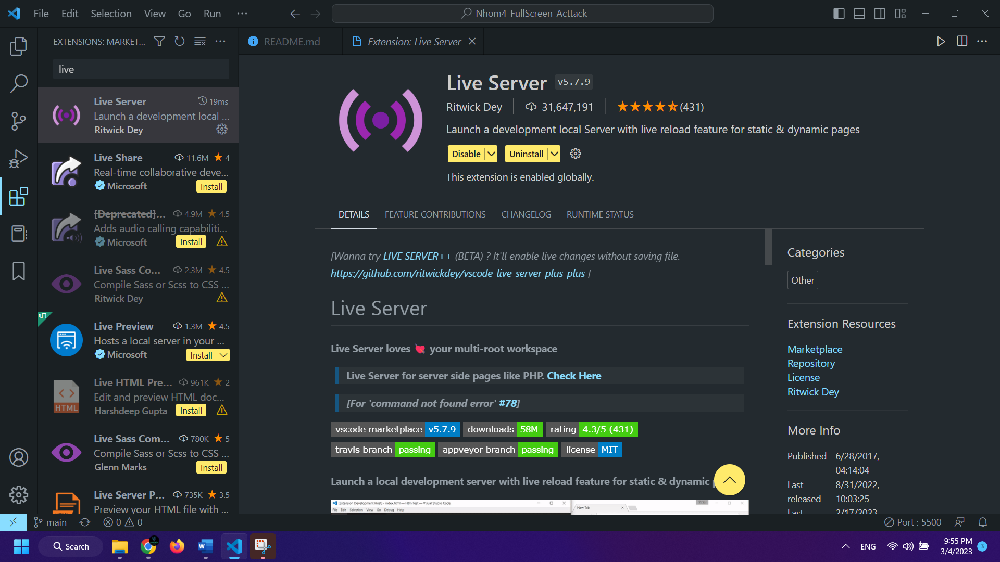
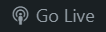
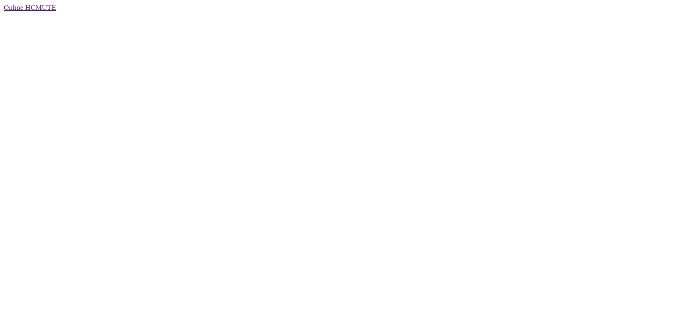
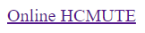
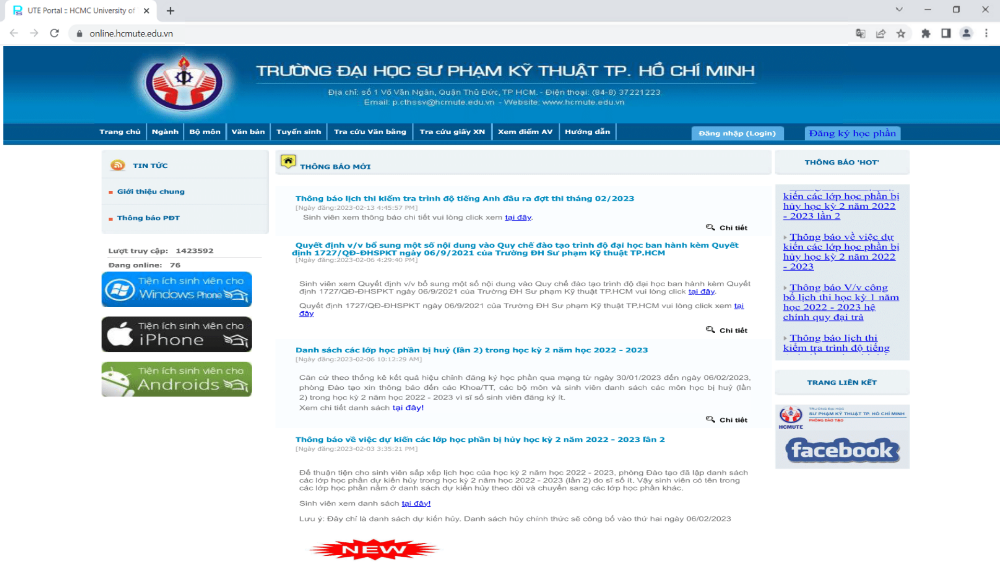
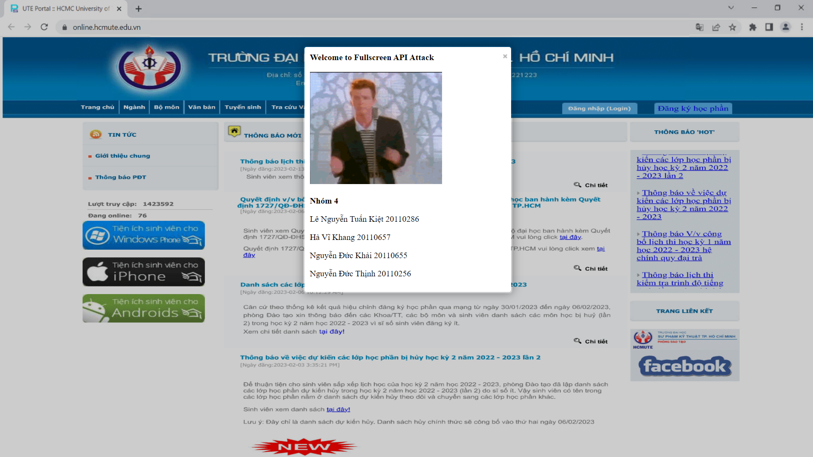

# Nhom4_FullScreen_Acttack

# Tên project: Online HCMUTE Fullscreen API Attack

# Giới thiệu
Đây là project môn bảo mật web đề tài Fullscreen API Attack của nhóm 4
Nhóm 4 gồm các thành viên:
Nguyễn Đức Khải - 20110655
Lê Nguyễn Tuấn Kiệt - 20110286
Nguyễn Đức Thịnh - 20110256
Hà Vĩ Khang - 20110657

**Fullscreen API Attack:** là dạng tấn công mà hacker sẽ tạo ra trang web giả mạo chạy full màn hình để đánh lừa người sử dụng, khi người sử dụng nhấn vào trang web giống hệt trang web thật, nhập thông tin và từ đó thông tin sẽ bị đánh cắp

# Cách cài đặt
Để cài đặt project chúng ta có thể clone từ git hub qua câu lệnh

`git clone https://github.com/KhaiNguyenDuc/Nhom4_FullScreen_Acttack.git`

Cài đặt thêm Extension Live Server

Hoặc để sử dụng online, không cần cài đặt thêm thì ta sử dụng link website đã deploy

**https://nhom4-fullscreen-api-acttack.herokuapp.com/**

# Cách sử dụng
Nếu chúng ta sử dụng online thì click vào link trên ở *Cách cài đặt*
Nếu chúng ta chạy local

### Bước 1:
Bấm vào biểu tượng live server  ở góc phải trên visual studio code
Trình duyệt sẽ chạy website lên ở localhost có giao diện như sau:

### Bước 2:
Bấm vào dòng chữ "Online HCMUTE"  để vào web online.hcmute.edu.vn

### Bước 3:
Giao diện web online của HCMUTE đã hiện lên

Chúng ta chọn vào đăng nhập để đăng nhập tài khoản
Lúc này một thông báo hiện lên là chúng ta đã bị Fullscreen API Attack

